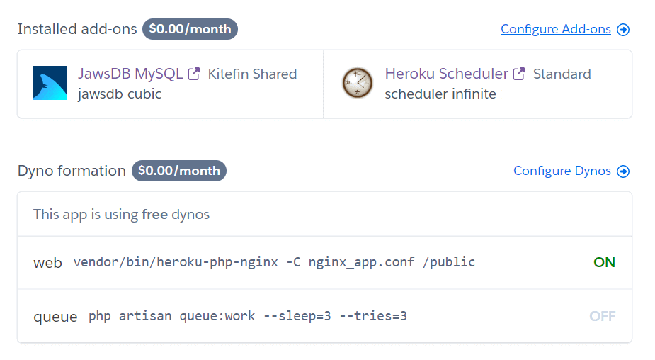

# Installing Monica on Heroku

Monica can be deployed on Heroku using the button below:

[](https://heroku.com/deploy?template=https://github.com/monicahq/monica/tree/master)

Before deployment, Heroku will ask you to define a few variables.
- Please ensure to enter a custom `APP_KEY` when asked (if, for example, you have the `pwgen` utility installed, you could copy and paste the output of `pwgen -s 32 1`).
- In addition, you can edit the email address Monica will send emails to (`MAIL_FROM_ADDRESS`), the name of the sender (`MAIL_FROM_NAME`) and some other important variables on that screen.

After deployment, click on  to open the dashboard of your new application:


Click on **Heroku Scheduler** to open scheduler dashboard. Create a new job, and define a new job to run this command every 10 minutes or every hour at 00 minutes:
```sh
php artisan schedule:run
```

You are now able to open the application and register a new user.

### Configuration 

Your Monica instance will use a [ClearDB Ignite plan](https://elements.heroku.com/addons/cleardb) (free) by default. Additional environment variables, such as details of the mail server, can be added after setup through the Heroku interface.
Monica doesn't require a lot of power - it will run perfectly fine on the free plan provided by Heroku. 

After deployment, the configuration of your app should look like this:


Note that when you deploy with the "Deploy to Heroku" purple button, only 1 dyno ("web") is activated while the "queue" one is not. That is OK - the "queue" dyno is only helpful if you set `QUEUE_CONNECTION=database` (default is 'sync').


### Optional: Setup the access tokens to use the API

In order to generate personal access tokens from the UI, you need to:

* Install the [Heroku CLI](https://devcenter.heroku.com/categories/command-line) and log in.
* From your command line, run
```sh
heroku run bash -a <APP-ID>
```
* Run
```sh
php artisan passport:keys
php artisan passport:client --personal --no-interaction
```

This command will generate encryption keys in the `storage` directory.
The two keys `oauth-private.key` and `oauth-public.key` cannot be backup and recreate in heroku directly.

* Still in the Heroku CLI, run this command to output the private key:
```sh
sed -E ':a;N;$!ba;s/\r{0,1}\n/\\n/g' ~/storage/oauth-private.key
```
  Copy the output to a new Heroku environment variable called `PASSPORT_PRIVATE_KEY`

* Do the same thing with the contents of the public key:
```sh
sed -E ':a;N;$!ba;s/\r{0,1}\n/\\n/g' ~/storage/oauth-public.key
```
  Copy its contents to a new Heroku environment variable called `PASSPORT_PUBLIC_KEY`


Once Heroku is re-deploy, you should be able to use the 'Create new token' function in https://XXX.herokuapp.com/settings/api

Once you have the token, you can use the API with a command line:
```
curl -H "Authorization: Bearer API_TOKEN" https://XXX.herokuapp.com/api
```

If everything is well, this call will return:
```json
{"success":{"message":"Welcome to Monica"}}
```


#### Optional: Generate a Password grant client for OAuth access

* Still in the Heroku CLI, run this command to generate a password grant client:
```
php artisan passport:client --password --no-interaction
```
* This will display a client ID and secret:
```
Password grant client created successfully.
Client ID: 5
Client secret: zsfOHGnEbadlBP8kLsjOV8hMpHAxb0oAhenfmSqq
```

* Copy the two values into two new environment variable of your `.env` file:
   - The value of client ID in a `MOBILE_CLIENT_ID` variable
   - The value of client secret in a `MOBILE_CLIENT_SECRET` variable

## Limitations

* No upload of photos for your contacts. Heroku doesn't support storage.
* No email by default - email configuration isn't required to use Monica on Heroku, but it's recommended.  You can configure your own [mailserver](/docs/installation/mail.md), though the easiest way to go about this is to use Mailgun's [free email add-on on Heroku](https://elements.heroku.com/addons/mailgun):
  * [Sign up for Mailgun](https://signup.mailgun.com/new/signup) (the [free plan](https://www.mailgun.com/pricing) should be sufficient)
  * Add a custom domain in mailgun.
  * Add the "To" and "From" e-mail addresses you're going to use as verified e-mail addresses on mailgun, and then actually verifying them.
  * Upgrade mailgun by entering a credit card (there is no charge, but they do require you enter it so you'll be upgraded to some other   tier that enables you to actually send messages).
  * Verify the custom domain via DNS (there are instructions on their site)
  * In Heroku, go to your app, then to the Settings tab. In it, you will have a button that reads "Reveal Config Vars". Click it, and change the following vars:
    * `MAIL_DRIVER`: `mailgun`
    * `MAILGUN_DOMAIN`: your Mailgun domain
    * `MAILGUN_SECRET`: your Mailgun API key — find it [here](https://app.mailgun.com/app/account/security)
    * `MAIL_FROM_ADDRESS`: email address to use for 'from' email (could just use your own)
    * `MAIL_FROM_NAME`: name of the 'from' user (could just use "Monica")
  

## Updating Heroku instance

You can update your Monica instance to the latest version by cloning the repository and pushing it to Heroku git.

Clone the Monica repository to your local environment by `git clone https://github.com/monicahq/monica`, and add heroku git repository by `heroku git:remote -a (heroku app name)`. Then, push to heroku by `git push heroku master`. Heroku will build and update the repository, automatically.
